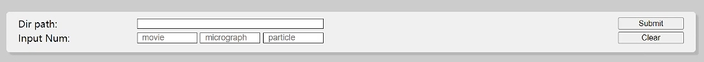
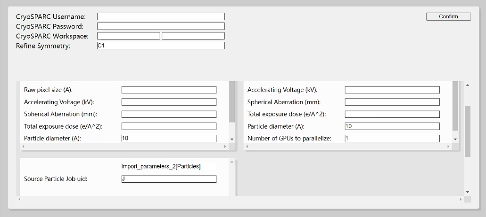
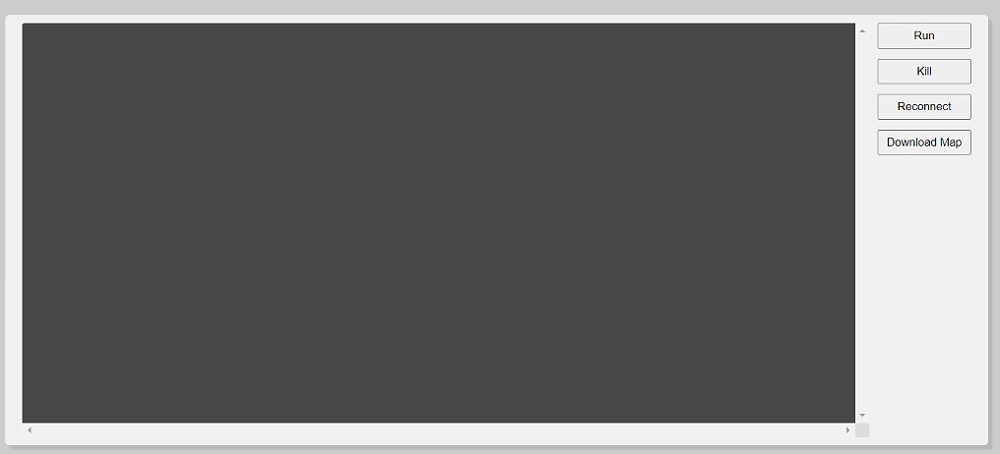
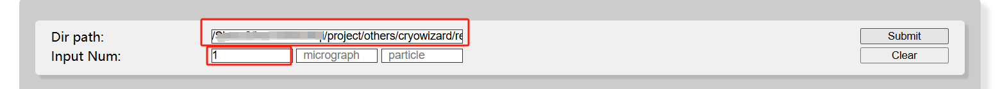
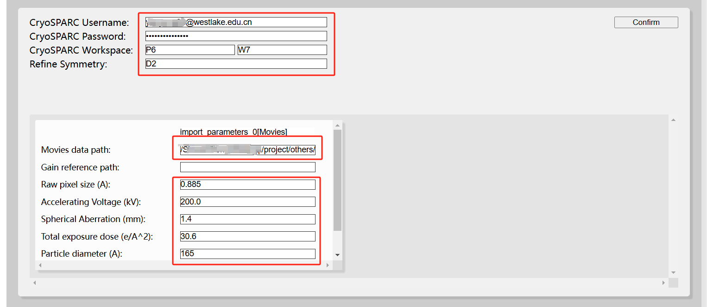
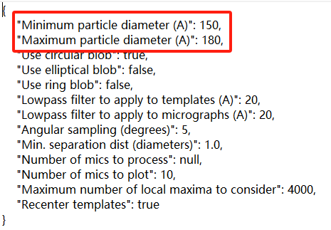
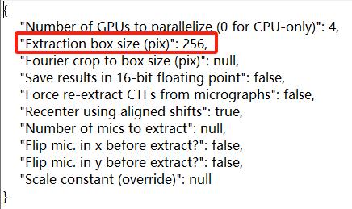
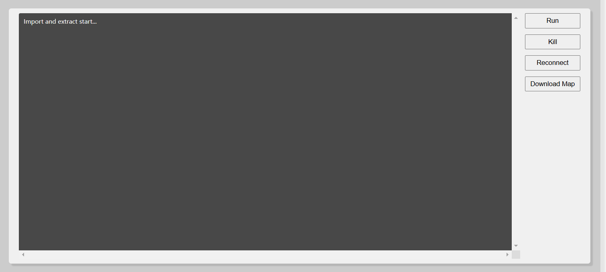
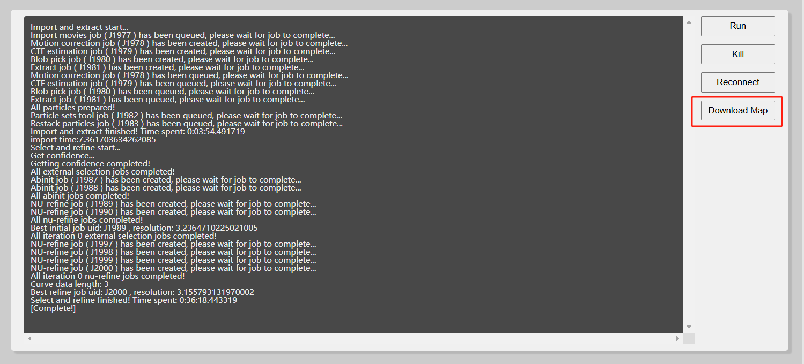
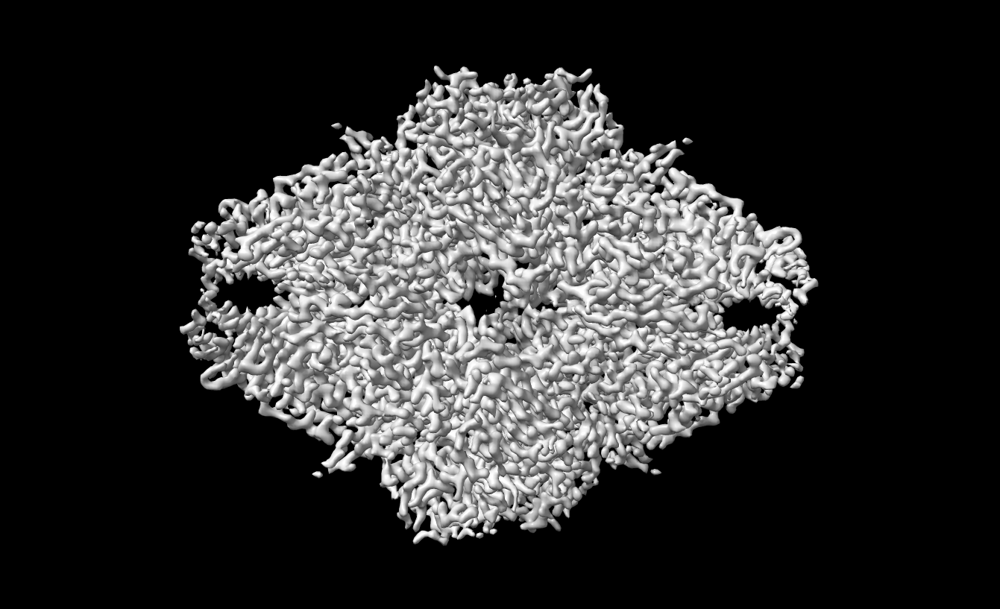

# A comprehensive foundation model for cryo-EM image processing
We present the Cryo-EM Image Evaluation Foundation (Cryo-IEF) model, which has been pre-trained on a substantial dataset comprising approximately 65 million cryo-EM particle images using unsupervised learning techniques. Cryo-IEF excels in various cryo-EM data processing tasks, such as classifying particles from different structures, clustering particles by pose, and assessing the quality of particle images. Upon fine-tuning, the model effectively ranks particle images by quality, enabling the creation of CryoWizard—a fully automated single-particle cryo-EM data processing pipeline. 


## Installation

### Basic Installation

You can set up the environment using the `requirements.txt` via `pip`:

    (base) $ conda create --name cryowizard python=3.10
    (base) $ conda activate cryowizard
    (cryowizard) $ cd path/to/requirements
    (cryowizard) $ pip install -r requirements.txt

Installation may take a few minutes. Alternatively, you can install the required packages using `conda`. All necessary packages are listed in `requirements.txt`, except for `conda install`, which can currently only be installed via `pip` (see [cryosparc-tools](https://tools.cryosparc.com/intro.html)).

### CryoWizard Installation
The CryoWizard pipeline utilizes APIs provided by CryoSPARC. Please ensure that you have installed [CryoSPARC](https://cryosparc.com/). Note that the version of `cryosparc-tools` specified in `requirements.txt` must correspond to your CryoSPARC installation.  

Model weights are available at [Cryo-IEF google drive](https://drive.google.com/drive/folders/1C9jIdC5B58ohAwrfRalTngRtLtgIWfM8?usp=sharing) and [CryoRanker google drive](https://drive.google.com/drive/folders/10SUzFZB2s9sGCDkYF258Yx1C11D3tiph?usp=drive_link).

After installing the environment, some necessary settings must be configured. 

1. In `path/to/cryowizard/code/CryoRanker/classification_inference_settings.yml`, set the path to the downloaded model weights:


        path_model_proj: path/to/downloaded/CryoRanker/model/weight/


2. Open `path/to/cryowizard/code/MyLib/cs_login_info.json` and configure parameters such as `license`, `host`, and `port`
for CryoSPARC server access. These settings are necessary to enable access to your CryoSPARC account.

[//]: # (## Quickstart)
## Cryo-IEF
Cryo-IEF is a foundation model for cryo-EM image evaluation, pre-trained on an extensive dataset using unsupervised learning. 
To generate particle features with Cryo-IEF encoder, run the following command:

    (base) $ conda activate cryowizard
    (cryowizard) $ python path/to/cryowizard/code/CryoIEF_inference.py --path_result_dir dir_to_save_results --path_model_proj dir_to_the_CryoIEF_model_weight --raw_data_path dir_to_cryoSPARC_job
Cryo-IEF processes only cryoSPARC job types that output particles, such as `Extracted Particles`, `Restack Particles`, and `Particles Sets`. 

The particle features extracted by the Cryo-IEF encoder are saved by default in `dir_to_save_results/features_all.data`.
The order of features aligns with the particle order in the`.cs` file located in `dir_to_cryoSPARC_job`.

During Cryo-IEF inference, raw data is preprocessed and cached in `dir_to_save_results/processed_data`.
After inference, this cache can be deleted while retaining the other output files.

## CryoRanker
CryoRanker integrates Cryo-IEF’s backbone encoder with an additional classification head, 
fine-tuned on a labeled dataset to rank particle images by quality.

    (base) $ conda activate cryowizard
    (cryowizard) $ python path/to/cryowizard/code/CryoRanker_inference.py --path_result_dir dir_to_save_results --path_model_proj dir_to_the_CryoRanker_model_weight --raw_data_path dir_to_cryoSPARC_job
CryoRanker processes only cryoSPARC job types that output particles, such as `Extracted Particles`, `Restack Particles`, and `Particles Sets`. 

The predicted scores are saved in `dir_to_save_results/scores_predicted_list.csv`.
The order of scores aligns with the particle order in the`.cs` file located in `dir_to_cryoSPARC_job`.

During CryoRanker inference, raw data is preprocessed and cached in `dir_to_save_results/processed_data`.
After inference, this cache can be deleted while retaining the other output files.

## CryoWizard 
⚠️ CryoWizard is in beta. Expect updates and potential changes to features. Please report any issues encountered.


### 1. Using CryoWizard via Web Interface

To launch the web application:

    (base) $ conda activate cryowizard
    (cryowizard) $ cd path/to/cryo-wizard-web
    (cryowizard) $ python CryoSelectWebApp.py

To change the web interface port, modify the last line in `CryoSelectWebApp.py` before launching. The default port is set to 38080.

```python
if (__name__ == '__main__'):
    app.run(host='0.0.0.0', port=38080)
```

Access the web interface at `http//:[server_address]:[port]`. In the first column, complete the following fields:



* **`Dir path`:** Directory for storing project metadata on the server.
* **`Input Num`:** Specifies the data type for import. For example, 
enter `1` in the first box and  leave the other two boxes empty (or set them to `0`) for movie data.

Click `Submit` will generate parameter cards in the second column. The `Clear` button deletes all files in the `Dir path`.

Next, complete the fields in the second column:



Since the pipeline is integrated with CryoSPARC, input your `CryoSPARC Username` and `CryoSPARC Password`. The `CryoSPARC Workspace` should indicate the project and workspace for pipeline jobs (e.g., P1 W1.). Ensure the workspace is already created in CryoSPARC. 
`Refine Symmetry` should match the protein symmetry in your data.

Parameter cards will appear based on the value entered in `Input Num`, 
with fields corresponding to those in CryoSPARC import jobs. 
After completing these entries, click `Confirm`.



To initiate the pipeline, click `Run`. Progress details will appear in the gray box on the left. Use `Kill` to terminate the running program. 

`Reconnect` aenables you to re-access the interface if it closes unexpectedly. If a pipeline run is interrupted, re-enter the `Dir path` in the first column, click  `Submit`, and then select `Reconnect` to continue viewing progress.

Once the pipeline completes, click the `Download Map` to download the `map_sharp` from the most recent best nu-refine job.

### 2. Using the Pipeline via Command Line

Create a pipeline project folder and parameter files:

    (base) $ conda activate cryowizard
    (cryowizard) $ cd path/to/your/project
    (cryowizard) $ python path/to/cryowizard/code/CreateParameterFiles.py

After executing these commands, a `parameter` folder will be created, and parameter files will be copied to this folder from `path/to/cryowizard/code/parameters`.

To create import job folders, consider the following example: if your raw data for a single target protein is separated, you may need to create two import movie jobs, one import micrograph job, and one import particle stack job to import all this raw data:

    ...
    (cryowizard) $ python path/to/cryowizard/code/CreateParameterFiles.py movie
    (cryowizard) $ python path/to/cryowizard/code/CreateParameterFiles.py movie
    (cryowizard) $ python path/to/cryowizard/code/CreateParameterFiles.py micrograph
    (cryowizard) $ python path/to/cryowizard/code/CreateParameterFiles.py particle

After executing these commands, four folders will be created in the `parameter` folder: `import_parameters_0`, `import_parameters_1`, `import_parameters_2`, `import_parameters_3`, 
corresponding to the movie, movie, micrograph, and particle jobs. Each `import_parameters_` folder will contain intact import parameters identical to those of CryoSPARC import jobs.

All parameter files in the `parameter` folder and `import_parameters_` folders can be opened and modified manually.

Once you have adjusted the parameters, proceed to import data and preprocess:

    ...
    (cryowizard) $ python path/to/cryowizard/code/ImportAndExtract.py

After running this command, jobs for import, motion correction, CTF estimation, blob picker, and extraction will be created and executed in CryoSPARC. All particles will be compiled in a restack job within CryoSPARC.

Now execute the following command:

    ...
    (cryowizard) $ python path/to/cryowizard/code/SelectAndRefine.py

This program utilizes our model to score and automatically select particles, which will then be used to reconstruct and refine the map volume. Upon completion, you can review the results in CryoSPARC.

Additionally, we provide a command to obtain the top `N` particles sorted by scores generated by the model after running `SelectAndRefine.py`:

    ...
    (cryowizard) $ python path/to/cryowizard/code/TruncateParticles.py N

This command will create an external job containing the output with the top `N` particles.

### 3. Parameters.json

The `parameters.json` ffile contains all adjustable pipeline parameters. You may customize these to suit your project needs.
The following is an example of the `parameters.json` file:

    {

    # linux_username and linux_password do not used now. Ignore them.
    "linux_username": "",
    "linux_password": "",
    
    # cryosparc_username and cryosparc_password are uesd to log in CryoSPARC
    "cryosparc_username": "",
    "cryosparc_password": "",
    
    # project and workspace: where to create jobs in CryoSPARC
    # safe mode: submit jobs on gpu forcibly or not. If false, Submit jobs on gpu forcibly, and lane, hostname_gpus_jobnum_lists and max_trying_time parameters will be used.
    # lane: CryoSPARC lane which will be used by CryoSPARC
    # hostname_gpus_jobnum_lists: max number of jobs running on each gpu, each item in this list is a list too, which is [node, gpu number, max job on each gpu]. e.g. "hostname_gpus_jobnum_lists": [["agpu44", 4, 2]],
    # low_cache_mode: if CryoSPARC has no enough cache space, please set this to true
    # if_slurm: if use slurm to run model. Slurm parameters can be modified in GetConfidence.sh after running CreateParameterFiles.py
    "project": "",
    "workspace": "",
    "lane": "default",
    "hostname_gpus_jobnum_lists": [],
    "low_cache_mode": false,
    "safe_mode": true,
    "if_slurm": true,
    
    # max_trying_time: (if safe_mode is true) how many times to restart a job if this job failed
    # max_particle_num_to_use: max particles used to score and select after running ImportAndExtract.py
    # base_abinit_particle_num and abinit_particle_num_step: e.g. if base_abinit_particle_num = 50000 and abinit_particle_num_step = 2, pipeline will create 2 abinit jobs and use top 50000 and top 100000 particles respectively
    # refine_iteration_num: how many times to iterate in pipeline
    # refine_iteration_min_particle_number_step: ignore refine_iteration_num, if particle number step in some iteration if smaller than this parameter, stop iteration.
    # refine_grid_num_in_each_turn: how many refine job will be created in each iteration. Need even number.
    # min_refine_truncation_confidence and max_refine_truncation_confidence: selection region by score
    # min_refine_particle_num and max_refine_particle_num: selection region by particle number
    "max_trying_time": 3,
    "max_particle_num_to_use": null,
    "base_abinit_particle_num": 50000,
    "abinit_particle_num_step": 2,
    "refine_iteration_num": 4,
    "refine_iteration_min_particle_number_step": null,
    "refine_grid_num_in_each_turn": 4,
    "min_refine_truncation_confidence": 0.8,
    "max_refine_truncation_confidence": 0.3,
    "min_refine_particle_num": 30000,
    "max_refine_particle_num": 3000000,
    
    # initial_orientation_balance: balance orientation or not
    # cfar_lower_bound: cfar lower bound to judge prefer orientation volume quality
    # resolution_lower_bound: resolution lower bound to judge prefer orientation volume quality
    # k: cluster number
    "initial_orientation_balance": true,
    "cfar_lower_bound": 0.15,
    "resolution_lower_bound": 4.0,
    "particle_num_multiple_for_cluster": 8.0,
    "k": 8,
    
    # delete_cache: delete cache folder after running SelectAndRefine.py or not
    "delete_cache": true
* The fields `linux_username` and `linux_password` are currently unused and can be ignored.
* `cryosparc_username` and `cryosparc_password` are used for logging into CryoSPARC.
* The `project` and `workspace` specify where jobs will be created in CryoSPARC.
* The `safe_mode` determines whether to submit jobs on the GPU forcibly, while the lane specifies the CryoSPARC `lane` to be utilized.
* The `hostname_gpus_jobnum_lists` lists the maximum number of jobs that can run on each GPU.
* The parameters pertaining to refinement specify various thresholds and iterations related to the processing pipeline.

## Test case
In this test case, we demonstrate how to use CryoWizard with the beta-galactosidase dataset, a small, widely-used dataset often featured in Relion tutorials. 
The movie data for this dataset can be downloaded from the [relion tutorial](https://relion.readthedocs.io/en/release-5.0/SPA_tutorial/Introduction.html/) or from our [google drive](https://drive.google.com/drive/folders/1OZc8pRgy31Qk646Xfe1jLh-URWroMI6Z?usp=sharing).

### STEP 1: Prepare the parameters



In the web interface, enter the following:

* **Dir path**: The directory where you want to store your project metadata.
* **Input Num**: Enter `1` to create one import movie job.

Click `Submit`, and parameter cards will be generated.



Next, move to the second column and enter the following:

* **CryoSPARC Username** and **CryoSPARC Password**.
* **CryoSPARC Workspace**: The project and workspace in CryoSPARC where you wish to create pipeline jobs (e.g., P6 W7). Ensure the workspace is already created in CryoSPARC.
* **Refine Symmetry**: The symmetry of the protein in your data. In this case, the beta-galactosidase dataset has a `D2` symmetry.
* **Movies data path**: The path to the movie data for the beta-galactosidase dataset.
* **Raw pixel size (A)**: The pixel size of the raw data. For the beta-galactosidase dataset, the pixel size is `0.885`.
* **Accelerating voltage (kV)**: The accelerating voltage used for data collection. For the beta-galactosidase dataset, the accelerating voltage is `200`.
* **Spherical aberration (mm)**: The spherical aberration of the microscope. For the beta-galactosidase dataset, the spherical aberration is `1.4`.
* **Total dose (e-/A^2)**: The total dose used for data collection. For the beta-galactosidase dataset, the total dose is `30.6`.
* **Particle Diameter (A)**: The diameter of the particle in the dataset. For the beta-galactosidase dataset, the particle diameter is `165`.

Once the parameters are entered, click `Confirm`, and the metadata will be generated in the specified `Dir path`.

#### OPTIONAL STEP: Revise the particle diameter for particle picking and extraction

By default, CryoWizard sets the minimum particle diameter to `Particle Diameter-10` and the maximum particle diameter to `Particle Diameter+10` for picking. 
The default particle extraction box size is `2*Particle Diameter`, where `Particle Diameter` is the value entered by the user.

To adjust the particle diameter for picking and extraction, navigate to the `/parameters/import_parameters_0/` folder in the `Dir path` and modify the `Minimum particle diameter (A)` and `"Maximum particle diameter (A)` in the `blob_picker_parameters.json` file.
For this dataset, you can adjust the values to:
* **Minimum particle diameter (A)**: `150`
* **Maximum particle diameter (A)**: `180`

As shown in the figure below.



To change the particle extraction box size, open the `/parameters/import_parameters_0/` folder within the `Dir path` and modify the `Extraction box size (pix)` in the `extract micrographs_parameters.json` file.
For this dataset, you can set the value to:
* **Extraction box size (pix)**: `256`

As shown in the figure below.



### STEP 2: Run CryoWizard



Click `run` to initiate the pipeline. Execution details will be displayed in the gray box on the left.



After the pipeline completes, click `Download Map` button to download the `map_sharp` from the most recent best nu-refine job.
The final map is shown below.



In this test case (using 5,078 particles), CryoRanker’s inference time is approximately 12 seconds on four V100 GPUs, with a total pipeline runtime of about 36 minutes.