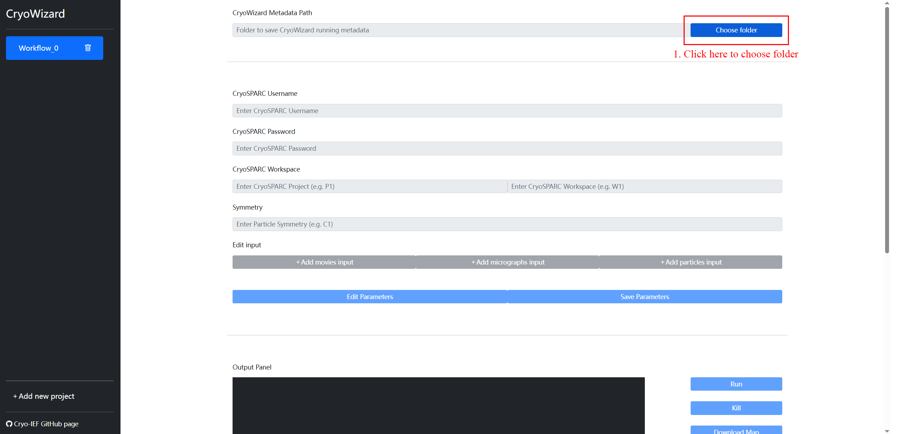
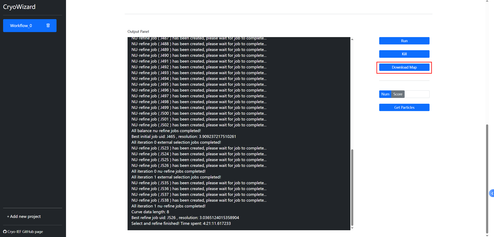

# A comprehensive foundation model for cryo-EM image processing


<a href="https://doi.org/10.1101/2024.11.04.621604"></a>
<a href="https://huggingface.co/westlake-repl/Cryo-IEF"></a>

We present the Cryo-EM Image Evaluation Foundation (Cryo-IEF) model, which has been pre-trained on a substantial dataset comprising approximately 65 million cryo-EM particle images using unsupervised learning techniques. Cryo-IEF excels in various cryo-EM data processing tasks, such as classifying particles from different structures, clustering particles by pose, and assessing the quality of particle images. Upon fine-tuning, the model effectively ranks particle images by quality, enabling the creation of CryoWizard—a fully automated single-particle cryo-EM data processing pipeline. 

## Installation

### Step 1: Conda Environment Setup

The environment can be configured using `pip` with the`requirements.txt` file:

    (base) $ conda create --name cryo_ief python=3.10
    (base) $ conda activate cryo_ief
    (cryo_ief) $ cd path/to/Cryo-IEF
    (cryo_ief) $ pip install -r requirements.txt

Installation may take several minutes. Subsequently, `cryosparc-tools` must be installed separately to ensure its version matches your CryoSPARC software. Please identify your CryoSPARC version and install the `cryosparc-tools` version that is closest to, and not exceeding, it.

For example, if your CryoSPARC version is 4.6.2, execute:
    
    (cryo_ief) $ pip install cryosparc-tools==999.999.999

You will get two ERROR messages like this:

    ERROR: Could not find a version that satisfies the requirement cryosparc-tools==999.999.999
    (from versions: 0.0.3, 4.1.0, 4.1.1, 4.1.2, 4.1.3, 4.2.0, 4.3.0, 4.3.1, 4.4.0, 4.4.1, 4.5.0, 4.5.1, 4.6.0, 4.6.1, 4.7.0)
    ERROR: No matching distribution found for cryosparc-tools==999.999.999

From the error output, identify the closest `cryosparc-tools` version (less than or equal to your CryoSPARC version), and then install it using the following command:

    (cryo_ief) $ pip install cryosparc-tools==4.6.1

Upon successful execution, the Conda environment setup will be complete.

### Step 2: Download Model Weights

Model weights are accessible via [HuggingFace](https://drive.google.com/drive/folders/1C9jIdC5B58ohAwrfRalTngRtLtgIWfM8?usp=sharing). Alternatively, they can be downloaded from the [Cryo-IEF google drive](https://drive.google.com/drive/folders/1C9jIdC5B58ohAwrfRalTngRtLtgIWfM8?usp=sharing) and [CryoRanker google drive](https://drive.google.com/drive/folders/10SUzFZB2s9sGCDkYF258Yx1C11D3tiph?usp=drive_link).


[//]: # (## Quickstart)
## Cryo-IEF
Cryo-IEF is a foundation model for cryo-EM image evaluation, pre-trained on an extensive dataset using unsupervised learning. 
To generate particle features with Cryo-IEF encoder, run the following command:

    (base) $ conda activate cryo_ief
    (cryo_ief) $ accelerate launch path/to/Cryo-IEF/code/CryoIEF_inference.py --path_result_dir dir/to/save/results --path_model_proj dir/to/CryoIEF_model_weight --raw_data_path dir/to/cryoSPARC_job
Cryo-IEF is compatible with cryoSPARC job types that generate particle outputs, including `Extracted Particles`, `Restack Particles`, and `Particles Sets`. 
By default, all available GPUs will be utilized for inference. Users can specify the number of GPUs to use with `--gpu_num` or list specific GPU IDs with `--gpu_ids` (e.g. `--gpu_ids 0,1,2,3`).

The particle features extracted by the Cryo-IEF encoder are saved by default to `dir/to/save/results/features_all.data`.
The order of features corresponds to the particle order in the`.cs` file located within `dir/to/cryoSPARC_job`.

During Cryo-IEF inference, raw data undergoes preprocessing and is cached in `dir/to/save/results/processed_data`.
This cache can be safely deleted after inference.

## CryoRanker
CryoRanker integrates Cryo-IEF’s backbone encoder with an additional classification head, 
fine-tuned on a labeled dataset to rank particle images by quality.

    (base) $ conda activate cryo_ief
    (cryo_ief) $ accelerate launch path/to/Cryo-IEF/code/CryoRanker_inference.py --path_result_dir dir/to/save/results --path_model_proj dir/to/CryoRanker_model_weight --raw_data_path dir/to/cryoSPARC_job --num_select N
CryoRanker is compatible with cryoSPARC job types that generate particle outputs, including `Extracted Particles`, `Restack Particles`, and `Particles Sets`. 
By default, all available GPUs will be utilized for inference. Users can specify the number of GPUs to use with `--gpu_num` or list specific GPU IDs with `--gpu_ids` (e.g. `--gpu_ids 0,1,2,3`).

Predicted scores are saved in `dir/to/save/results/scores_predicted_list.csv`.
The order of scores corresponds to the particle order in the `.cs` file located within `dir_to_cryoSPARC_job`.
If `--num_select` is set to `N`, the top `N` particles will be selected and saved as `dir/to/save/results/selected_particles_top_N.cs` and `.../selected_particles_top_N.star`. 
These selected particles can then be loaded into cryoSPARC or RELION for subsequent processing.

During CryoRanker inference, raw data undergoes preprocessing and is cached in `dir/to/save/results/processed_data`.
This cache can be safely deleted after inference.

## CryoWizard 
⚠️ CryoWizard is in beta. Expect updates and potential changes to features. Please report any issues encountered.

 If you want to submit model inference tasks with [Slurm](https://slurm.schedmd.com/), set `if_slurm` to `true` in `parameters.json` and make that slurm is installed on your server.


### Run Install Progress

    (base) $ conda activate cryo_ief
    (cryo_ief) $ cd path/to/Cryo-IEF
    (cryo_ief) $ python CryoWizard_main.py \
        --CryoWizardInstall \
        --cryosparc_username 'your_cryosparc_username@XXX.XXX' \
        --cryosparc_password 'your_cryosparc_password' \
        --cryosparc_license 'XXXXXXXX-XXXX-XXXX-XXXX-XXXXXXXXXXXX' \
        --cryosparc_hostname your_host_name \
        --cryosparc_port 39000 \
        --cryoranker_model_weight 'path/to/your/downloaded/cryo_ranker_model_weight_folder'


### Using CryoWizard via Web Interface

#### Step 1. Launching the Web Interface

To launch the web application, execute:

    (cryo_ief) $ cd path/to/Cryo-IEF/CryoWizard/CryoWizard_web
    (cryo_ief) $ python CryoWizardWebApp.py

To modify the web interface port, adjust the `web_port` parameter in `path/to/Cryo-IEF/CryoWizard/cryowizard_settings.yml` prior to launching. The default port is 38080.

```
CryoWizardWebApp_settings:
   web_port: 38080
```

Access the web interface at `http//:[server_address]:[port]`. 

#### Step 2. Set Parameters and Run CryoWizard

Upon accessing the CryoWizard web interface, users will observe the following layout. 
The left panel functions as a navigation bar, enabling the management, switching, and viewing of multiple workflows. 
Workflows can be removed from the display by clicking the adjacent delete button; however, this action does not remove the corresponding files.


To configure and initiate a CryoWizard workflow, 
click the "choose folder" button in block 1 and select the directory designated for storing the workflow's metadata:




Upon path selection, click the "Save" button to instruct CryoWizard to generate essential metadata files within the specified directory.

Subsequently, the following parameters must be configured: 
1. Basic parameters for CryoSPARC login and job execution.
2. Specify the input data type (movie/micrograph/particle). Multiple input types can be added concurrently by repeatedly clicking the "Add XXX input" button and populating the respective parameters. CryoWizard will integrate and utilize all provided input data.
3. After all parameters in the first and second sections have been entered, click "Save Parameters".


Click the `run` button to initiate the automated CryoWizard pipeline. To terminate the operation prematurely, click the "Kill" button. 


Upon completion of the operation, information similar to the following will be displayed:


All jobs generated by CryoWizard can be reviewed within your CryoSPARC interface.


Following completion of the operation, the final 3D volume can be downloaded by clicking "Download Map".

To obtain a specified number of high-quality particles (ranked by CryoRanker scores from highest to lowest) or all particles exceeding a defined score threshold, navigate to the "Get Particles" section and select either "Num" or "Score". Enter the desired truncation value (e.g., 10000 or 0.85), then click "Get Particles". This action will generate an external cryoSPARC job whose output comprises the selected particles, which can then be utilized for downstream processing within CryoSPARC.


### 2. Executing the Full Pipeline via a Single Command


#### Single-Command Pipeline Execution

The complete CryoWizard pipeline can be executed via a single command:

    (cryo_ief) $ python CryoWizard_main.py \
        --path_result_dir 'path/to/save/your/cryowizard/metadata/folder' \
        --CreateParameterFiles \
        --CreateImportParameterFiles \
        --ImportAndExtract \
        --SelectAndRefine \
        --input_type movie \
        --cryosparc_username 'your_cryosparc_username@xxx.xxx' \
        --cryosparc_password 'your_cryosparc_password' \
        --cryosparc_project P1 \
        --cryosparc_workspace W1 \
        --symmetry D2 \
        --movies_data_path 'path/to/movies_files' \
        --gain_reference_path 'path/to/gain_reference_files' \        
        --raw_pixel_size 0.885 \
        --accelerating_voltage 200 \
        --spherical_aberration 1.4 \
        --total_exposure_dose 30.6 \
        --particle_diameter 160 \
        --gpu_num 1

This command will import movie data and execute the entire pipeline, which will be visible within your cryoSPARC interface.

Also, micrographs can be specified as input:

    (cryo_ief) $ python CryoWizard_main.py \
        --path_result_dir 'path/to/save/your/cryowizard/metadata/folder' \
        --CreateParameterFiles \
        --CreateImportParameterFiles \
        --ImportAndExtract \
        --SelectAndRefine \
        --input_type micrograph \
        --cryosparc_username 'your_cryosparc_username@xxx.xxx' \
        --cryosparc_password 'your_cryosparc_password' \
        --cryosparc_project P1 \
        --cryosparc_workspace W1 \
        --symmetry D2 \
        --micrographs_data_path 'path/to/micrographs_files' \
        --raw_pixel_size 0.885 \
        --accelerating_voltage 200 \
        --spherical_aberration 1.4 \
        --total_exposure_dose 30.6 \
        --particle_diameter 160 \
        --gpu_num 1

or a cryoSPARC particle job (e.g., `Import Particle Stack`, `Extract From Micrographs(Multi-GPU)`, `Restack Particles`) as input:

    (cryo_ief) $ python CryoWizard_main.py \
        --path_result_dir 'path/to/save/your/cryowizard/metadata/folder' \
        --CreateParameterFiles \
        --CreateImportParameterFiles \
        --ImportAndExtract \
        --SelectAndRefine \
        --input_type particle \
        --cryosparc_username 'your_cryosparc_username@xxx.xxx' \
        --cryosparc_password 'your_cryosparc_password' \
        --cryosparc_project P1 \
        --cryosparc_workspace W1 \
        --symmetry D2 \
        --particle_job_uid J1

Note that the single-command pipeline execution supports only one type of input data. For multiple input types, utilize the CryoWizard web interface or execute the pipeline step-by-step.

#### Step-by-Step Pipeline Execution

To create a pipeline project folder and generate parameter files, execute:

    (cryo_ief) $ python CryoWizard_main.py \
        --path_result_dir 'path/to/save/your/cryowizard/metadata/folder' \
        --CreateParameterFiles \
        --cryosparc_username 'your_cryosparc_username@xxx.xxx' \
        --cryosparc_password 'your_cryosparc_password' \
        --cryosparc_project P1 \
        --cryosparc_workspace W1 \
        --symmetry D2

Upon execution of these commands, a `parameter` folder will be created, and parameter files will be copied to this folder from `path/to/Cryo-IEF/CryoWizard/parameters`.

To generate import job folders, consider the following example: if raw data for a single target protein is distributed across multiple sources, it may necessitate the creation of two import movie jobs, one import micrograph job, and one import particle stack job to consolidate all raw data:

    ...
    (cryo_ief) $ python CryoWizard_main.py \
        --path_result_dir 'path/to/save/your/cryowizard/metadata/folder' \
        --CreateImportParameterFiles \
        --input_type movie \
        --movies_data_path 'path/to/movies_files' \
        --gain_reference_path 'path/to/gain_reference_files' \        
        --raw_pixel_size 0.885 \
        --accelerating_voltage 200 \
        --spherical_aberration 1.4 \
        --total_exposure_dose 30.6 \
        --particle_diameter 160 \
        --gpu_num 1
    (cryo_ief) $ python CryoWizard_main.py \
        --path_result_dir 'path/to/save/your/cryowizard/metadata/folder' \
        --CreateImportParameterFiles \
        --input_type movie \
        --movies_data_path 'path/to/movies2_files' \
        --gain_reference_path 'path/to/gain_reference2_files' \        
        --raw_pixel_size 0.885 \
        --accelerating_voltage 200 \
        --spherical_aberration 1.4 \
        --total_exposure_dose 30.6 \
        --particle_diameter 160 \
        --gpu_num 1
    (cryo_ief) $ python CryoWizard_main.py \
        --path_result_dir 'path/to/save/your/cryowizard/metadata/folder' \
        --CreateImportParameterFiles \
        --input_type micrograph \
        --micrographs_data_path 'path/to/micrographs_files' \
        --raw_pixel_size 0.885 \
        --accelerating_voltage 200 \
        --spherical_aberration 1.4 \
        --total_exposure_dose 30.6 \
        --particle_diameter 160 \
        --gpu_num 1
    (cryo_ief) $ python CryoWizard_main.py \
        --path_result_dir 'path/to/save/your/cryowizard/metadata/folder' \
        --CreateImportParameterFiles \
        --input_type particle \
        --particle_job_uid J1

Upon execution of these commands, four folders will be generated within the `parameter` directory: `import_parameters_0`, `import_parameters_1`, `import_parameters_2`, and `import_parameters_3`. 
These correspond to the movie, movie, micrograph, and particle jobs, respectively. Each `import_parameters_` folder will contain complete import parameters identical to those used by cryoSPARC import jobs.

All parameter files in the `parameter` folder and `import_parameters_` folders can be manually opened and modified.

Once parameters have been adjusted, proceed with data import and preprocessing:

    ...
    (cryo_ief) $ python CryoWizard_main.py \
        --path_result_dir 'path/to/save/your/cryowizard/metadata/folder' \
        --ImportAndExtract

Execution of this command will initiate the creation and execution of import, motion correction, CTF estimation, blob picker, and extraction jobs within cryoSPARC. All particles will subsequently be consolidated into a single restack job within cryoSPARC.

Next, execute the following command:

    ...
    (cryo_ief) $ python CryoWizard_main.py \
        --path_result_dir 'path/to/save/your/cryowizard/metadata/folder' \
        --SelectAndRefine

This program employs our model to score and automatically select particles, which are then utilized for map volume reconstruction and refinement. Upon completion, results can be reviewed within cryoSPARC.

Additionally, a command is provided to retrieve the top `N` particles (e.g. 50000), sorted by scores generated by the model after executing `SelectAndRefine`:

    ...
    (cryo_ief) $ python CryoWizard_main.py \
        --TruncateParticles \
        --truncation_type num \
        --particle_cutoff_condition N

This command will generate an external job containing the output with the top `N` particles. 

Alternatively, by providing a score `S` (e.g. 0.9), particles with scores greater than the specified threshold can be retrieved:

    ...
    (cryo_ief) $ python CryoWizard_main.py \
        --TruncateParticles \
        --truncation_type score \
        --particle_cutoff_condition S

### (Optional) More Settings in Parameters.json

The `parameters.json` file in your workflow metadata path contains all adjustable pipeline parameters. You may customize these to suit your project needs.
The following is an example of the `parameters.json` file:

    {
    
    # cryosparc_username and cryosparc_password are uesd to log in CryoSPARC
    "cryosparc_username": null,
    "cryosparc_password": null,
    
    # project and workspace: where to create jobs in CryoSPARC
    # lane: CryoSPARC lane which will be used by CryoSPARC
    # hostname_gpus_jobnum_lists: max number of jobs running on each gpu, each item in this list is a list too, which is [node, gpu number, max job on each gpu]. e.g. "hostname_gpus_jobnum_lists": [["agpu44", 4, 2]],
    # safe mode: submit jobs on gpu forcibly or not. If false, Submit jobs on gpu forcibly, and lane, hostname_gpus_jobnum_lists and max_trying_time parameters will be used.
    # low_cache_mode: if CryoSPARC has no enough cache space, please set this to true
    # if_slurm: if use slurm to run model. Slurm parameters can be modified manually in GetConfidence.sh after running CreateParameterFiles.py
    "project": null,
    "workspace": null,
    "lane": "default",
    "hostname_gpus_jobnum_lists": [],
    "safe_mode": true,
    "low_cache_mode": false,
    
    # max_trying_time: (if safe_mode is true) how many times to restart a job if this job failed
    # max_particle_num_to_use: max particles used to score and select after running ImportAndExtract.py
    # base_abinit_particle_num and abinit_particle_num_step: e.g. if base_abinit_particle_num = 50000 and abinit_particle_num_step = 2, pipeline will create 2 abinit jobs and use top 50000 and top 100000 particles respectively
    # refine_iteration_num: how many times to iterate in pipeline
    # refine_iteration_min_particle_number_step: ignore refine_iteration_num, if particle number step in some iteration if smaller than this parameter, stop iteration.
    # refine_grid_num_in_each_turn: how many refine job will be created in each iteration. Need even number.
    # min_refine_truncation_confidence and max_refine_truncation_confidence: selection region by score
    # min_refine_particle_num and max_refine_particle_num: selection region by particle number
    "max_trying_time": 3,
    "max_particle_num_to_use": null,
    "base_abinit_particle_num": 50000,
    "abinit_particle_num_step": 2,
    "refine_iteration_num": 2,
    "refine_iteration_min_particle_number_step": null,
    "refine_grid_num_in_each_turn": 4,
    "min_refine_truncation_confidence": 0.8,
    "max_refine_truncation_confidence": 0.3,
    "min_refine_particle_num": 30000,
    "max_refine_particle_num": 3000000,
    
    # initial_orientation_balance: balance orientation or not
    # cfar_lower_bound: cfar lower bound to judge prefer orientation volume quality
    # resolution_lower_bound: resolution lower bound to judge prefer orientation volume quality
    # k: cluster number
    "initial_orientation_balance": true,
    "cfar_lower_bound": 0.15,
    "resolution_lower_bound": 4.0,
    "particle_num_multiple_for_cluster": 8.0,
    "k": 8,
    
    # if_slurm: if use slurm to run model. Slurm parameters can be modified manually in GetConfidence.sh after creating base parameters.
    # delete_cache: delete cache folder after running SelectAndRefine.py or not
    # inference_gpu_ids: when running CryoRanker inference during CryoWizard, it will use all gpus which are available by default. And you can set this parameter to indicate the gpu ids you would like to use (e.g. '0,2' means gpu 0 and 2 will be used)
    # accelerate_port_start and accelerate_port_end: this means accelerate process will choose port during 28000-30000.
    "if_slurm": false,
    "delete_cache": true,
    "inference_gpu_ids": null,
    "accelerate_port_start": 28000,
    "accelerate_port_end": 30000


### Test case
This test case demonstrates the application of CryoWizard using the beta-galactosidase dataset, a small, widely-used dataset frequently featured in RELION tutorials.
Movie data for this dataset can be downloaded from the [relion tutorial](https://relion.readthedocs.io/en/release-5.0/SPA_tutorial/Introduction.html/) or from our [google drive](https://drive.google.com/drive/folders/1OZc8pRgy31Qk646Xfe1jLh-URWroMI6Z?usp=sharing).

#### STEP 1: Prepare the parameters


Within the web interface, provide the following details:

* **CryoWizard Metadata Path**: The designated directory for storing CryoWizard workflow metadata.

Click `Save` to generate the foundational parameter files.


Subsequently, proceed to the parameters section. As the test case utilizes movie raw input data, first click `Add movies input`, then provide the following:

* **CryoSPARC Username** and **CryoSPARC Password**.
* **CryoSPARC Workspace**: The target project and workspace within CryoSPARC for pipeline job creation (e.g., P6 W7). Ensure this workspace exists in CryoSPARC prior to use.
* **Symmetry**: The symmetry of the protein in the dataset. For the beta-galactosidase dataset, `D2` symmetry is applicable.
* **Movies data path**: The file path to the movie data for the beta-galactosidase dataset.
* **Raw pixel size (Å)**: The pixel size of the raw data. For the beta-galactosidase dataset, the pixel size is `0.885`.
* **Accelerating voltage (kV)**: The accelerating voltage employed during data collection. For the beta-galactosidase dataset, the accelerating voltage is `200`.
* **Spherical aberration (mm)**: The spherical aberration coefficient of the microscope. For the beta-galactosidase dataset, this value is `1.4`.
* **Total dose (e-/Å^2)**: The total electron dose applied during data collection. For the beta-galactosidase dataset, the total dose is `30.6`.
* **Particle Diameter (Å)**: The diameter of the particles within the dataset. For the beta-galactosidase dataset, the particle diameter is `160`.
* **Number of GPUs to parallelize**: The count of GPUs allocated for parallel execution of Motion Correction, CTF Estimation, and Extract Particles jobs within CryoSPARC.


Once all parameters have been entered, click `Save Parameters`, to generate the metadata in the designated `CryoWizard Metadata Path`.

#### OPTIONAL STEP: Revise the particle diameter for particle picking and extraction

By default, CryoWizard sets the minimum particle diameter to `Particle Diameter-10` and the maximum particle diameter to `Particle Diameter+10` for picking. 
The default particle extraction box size is `2*Particle Diameter`, where `Particle Diameter` is the value entered by the user.

To adjust the particle diameter for picking and extraction, navigate to the `/parameters/import_parameters_0/` folder in the `CryoWizard Metadata Path` and modify the `Minimum particle diameter (Å)` and `"Maximum particle diameter (Å)` in the `blob_picker_parameters.json` file.
For this dataset, you can adjust the values to:
* **Minimum particle diameter (Å)**: `150`
* **Maximum particle diameter (Å)**: `180`

As shown in the figure below.


To change the particle extraction box size, open the `/parameters/import_parameters_0/` folder within the `CryoWizard Metadata Path` and modify the `Extraction box size (pix)` in the `extract micrographs_parameters.json` file.
For this dataset, you can set the value to:
* **Extraction box size (pix)**: `256`

As shown in the figure below.


#### STEP 2: Run CryoWizard


Click `run` to initiate the pipeline. Execution details will be displayed in the gray box on the left.



Upon pipeline completion, click the `Download Map` button to download the `map_sharp` from the most recent best nu-refine job.
The final map is shown below.


For this test case (utilizing 4,786 particles), CryoRanker’s inference time is approximately 29 seconds on four V100 GPUs, with a total pipeline runtime of about 4 hours and 21 minutes.