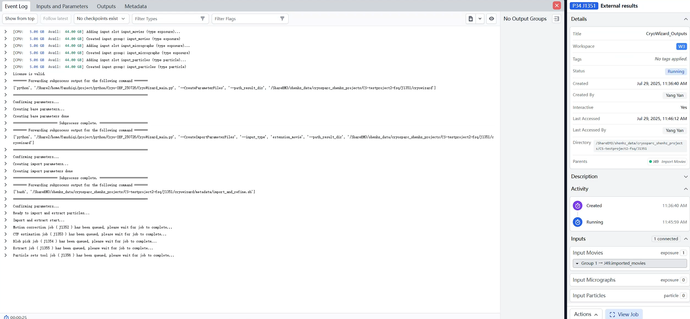

## Using the CryoWizard Chrome Extension


### Step 1. Launch the Server Interface

To launch the server application, execute the following commands:

    (cryo_ief) $ cd path/to/Cryo-IEF/CryoWizard/CryoWizard_Chrome_Extension
    (cryo_ief) $ python CryoWizardChromeExtensionServer.py

To modify the server interface port, adjust the `web_port` parameter in `path/to/Cryo-IEF/CryoWizard/cryowizard_settings.yml` file before launching. The default port is 38080.

```
CryoWizardWebApp_settings:
   web_port: 38080
```

The server interface will now be accessible to your Chrome extension at `http//:[server_address]:[port]`. 

### Step 2. Install CryoWizard Chrome Extension

This extension is for the Google Chrome browser. If you do not have Chrome, you can download it from the [Chrome official website](https://www.google.com/chrome/).

1. Unzip the `extension.rar` file located in `path/to/Cryo-IEF/CryoWizard/CryoWizard_Chrome_Extension`. This will create a folder named `extension`.

2. Open Chrome and navigate to `Settings -> Extensions -> Manage Extensions`

    

3. Turn on `Developer mode` in the top-right corner. 

   
4. Click `Load Unpacked`
   
   

5. Select the `extension` folder you created in the first step.

   

   The CryoWizard Chrome extension is now installed. Before proceeding, ensure it is activated (toggled on) in the extensions list.

   

### Step 3. Using CryoWizard Chrome Extension

1. In the Chrome toolbar, click the `Extensions` icon and select `CryoWizard`

   

2. In the pop-up window, enter the server address (`http//:[server_address]:[port]`) from Step 1, enter the same username and password you use to log in to CryoSPARC.

   

3. Log in to your CryoSPARC account and navigate to any project workspace. Refresh your web page, the `CryoWizard` button  will now appear in the job builder interface. The CryoWizard button will only appear within a workspace.
   

4. Click the `CryoWizard` button to create a `CryoWizard External Job`. Click the `build` button on this job to configure it.

   

5. Link the required jobs to the **Inputs** tab, fill in the parameters, and click **Queue Job**. The CryoWizard task will start automatically within a few seconds.

   

6. While the job is running, CryoWizard will automatically create and queue new jobs. You can monitor the output in the event log of the `CryoWizard External Job`.

   

   

7. To terminate the task, click the  `Kill Job` button of the CryoWizard External Job just like closing other CryoSPARC jobs, and the running CryoWizard will stop.

   