## Using CryoWizard via Web Interface


### Step 1. Launching the Web Interface

To launch the web application, execute:

    (cryo_ief) $ cd path/to/Cryo-IEF/CryoWizard/CryoWizard_web
    (cryo_ief) $ python CryoWizardWebApp.py

To modify the web interface port, adjust the `web_port` parameter in `path/to/Cryo-IEF/CryoWizard/cryowizard_settings.yml` prior to launching. The default port is 38080.

```
CryoWizardWebApp_settings:
   web_port: 38080
```

Access the web interface at `http//:[server_address]:[port]`. 

### Step 2. Set Parameters and Run CryoWizard

Upon accessing the CryoWizard web interface, users will observe the following layout. 
The left panel functions as a navigation bar, enabling the management, switching, and viewing of multiple workflows. 
Workflows can be removed from the display by clicking the adjacent delete button; however, this action does not remove the corresponding files.

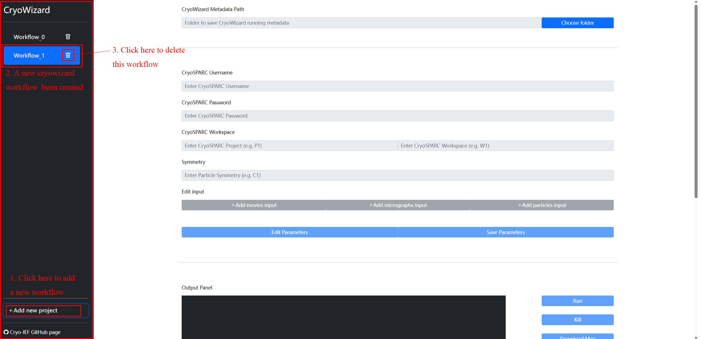

To configure and initiate a CryoWizard workflow, 
click the "choose folder" button in block 1 and select the directory designated for storing the workflow's metadata:

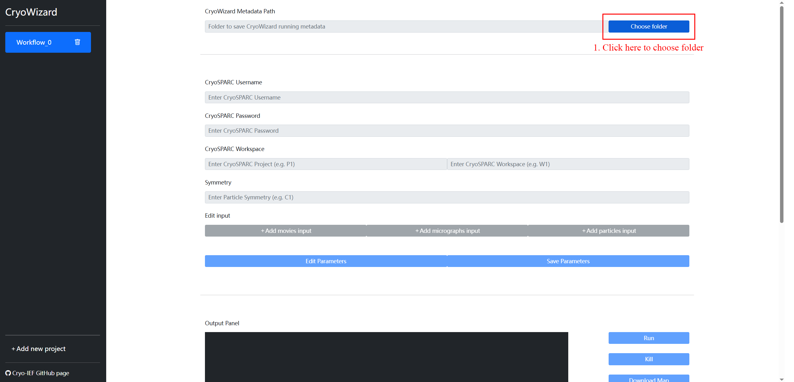

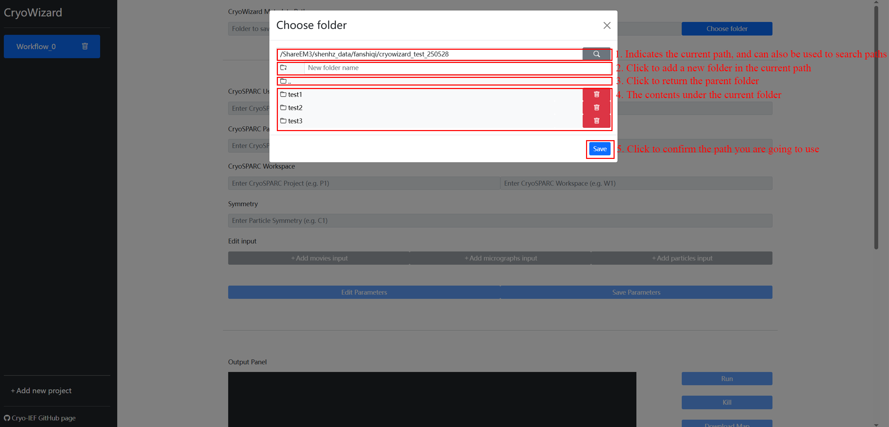

Upon path selection, click the "Save" button to instruct CryoWizard to generate essential metadata files within the specified directory.

Subsequently, the following parameters must be configured: 
1. Basic parameters for CryoSPARC login and job execution.
2. Specify the input data type (movie/micrograph/particle). Multiple input types can be added concurrently by repeatedly clicking the "Add XXX input" button and populating the respective parameters. CryoWizard will integrate and utilize all provided input data.
3. After all parameters in the first and second sections have been entered, click "Save Parameters".

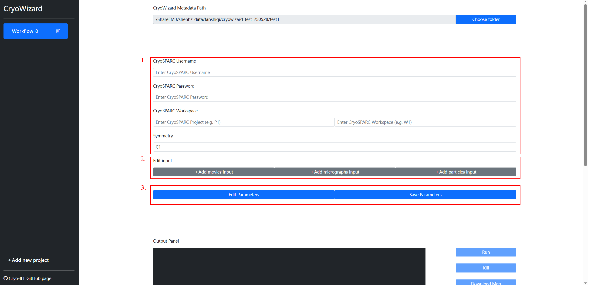


Click the `run` button to initiate the automated CryoWizard pipeline. To terminate the operation prematurely, click the "Kill" button. 

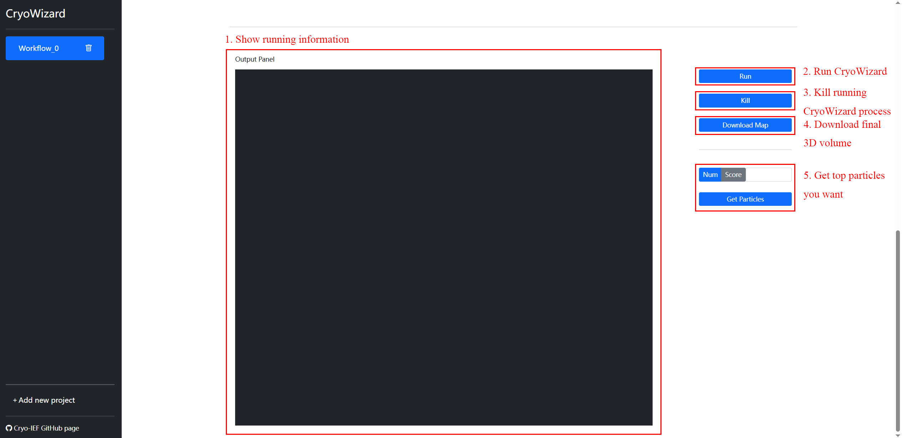

Upon completion of the operation, information similar to the following will be displayed:

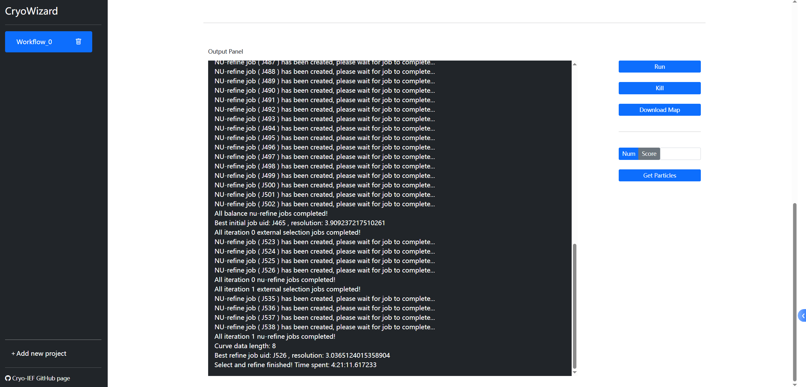

All jobs generated by CryoWizard can be reviewed within your CryoSPARC interface.

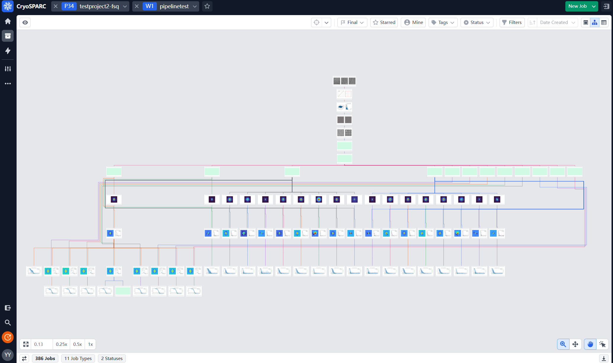

Following completion of the operation, the final 3D volume can be downloaded by clicking "Download Map".

To obtain a specified number of high-quality particles (ranked by CryoRanker scores from highest to lowest) or all particles exceeding a defined score threshold, navigate to the "Get Particles" section and select either "Num" or "Score". Enter the desired truncation value (e.g., 10000 or 0.85), then click "Get Particles". This action will generate an external cryoSPARC job whose output comprises the selected particles, which can then be utilized for downstream processing within CryoSPARC.
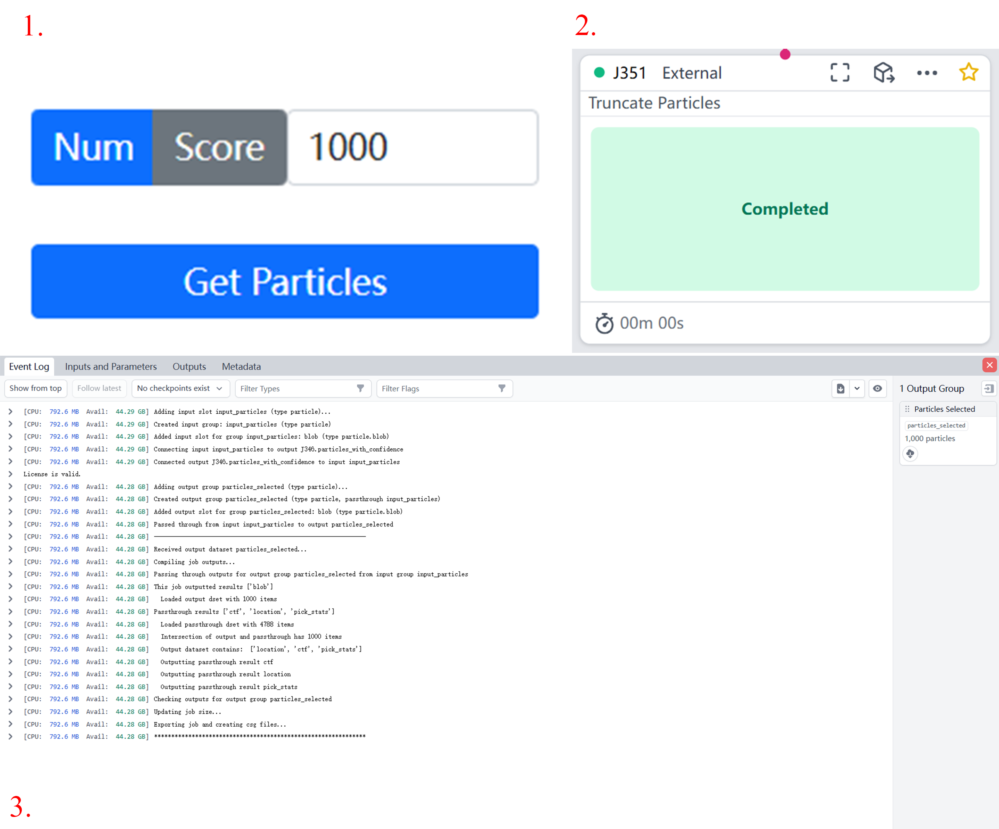

## Test case
This test case demonstrates the application of CryoWizard using the beta-galactosidase dataset, a small, widely-used dataset frequently featured in RELION tutorials.
Movie data for this dataset can be downloaded from the [relion tutorial](https://relion.readthedocs.io/en/release-5.0/SPA_tutorial/Introduction.html/) or from our [google drive](https://drive.google.com/drive/folders/1OZc8pRgy31Qk646Xfe1jLh-URWroMI6Z?usp=sharing).

### STEP 1: Prepare the parameters


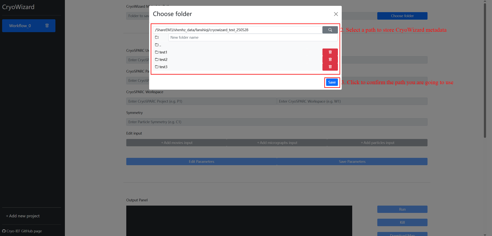

Within the web interface, provide the following details:

* **CryoWizard Metadata Path**: The designated directory for storing CryoWizard workflow metadata.

Click `Save` to generate the foundational parameter files.

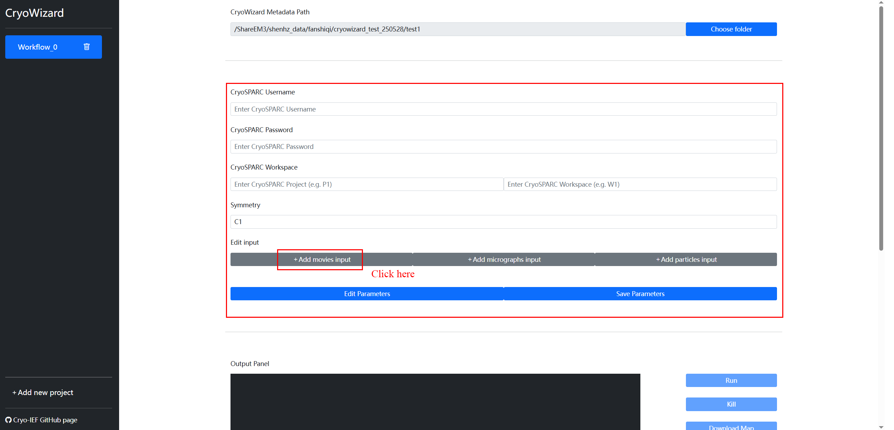

Subsequently, proceed to the parameters section. As the test case utilizes movie raw input data, first click `Add movies input`, then provide the following:

* **CryoSPARC Username** and **CryoSPARC Password**.
* **CryoSPARC Workspace**: The target project and workspace within CryoSPARC for pipeline job creation (e.g., P6 W7). Ensure this workspace exists in CryoSPARC prior to use.
* **Symmetry**: The symmetry of the protein in the dataset. For the beta-galactosidase dataset, `D2` symmetry is applicable.
* **Movies data path**: The file path to the movie data for the beta-galactosidase dataset.
* **Raw pixel size (Å)**: The pixel size of the raw data. For the beta-galactosidase dataset, the pixel size is `0.885`.
* **Accelerating voltage (kV)**: The accelerating voltage employed during data collection. For the beta-galactosidase dataset, the accelerating voltage is `200`.
* **Spherical aberration (mm)**: The spherical aberration coefficient of the microscope. For the beta-galactosidase dataset, this value is `1.4`.
* **Total dose (e-/Å^2)**: The total electron dose applied during data collection. For the beta-galactosidase dataset, the total dose is `30.6`.
* **Particle Diameter (Å)**: The diameter of the particles within the dataset. For the beta-galactosidase dataset, the particle diameter is `160`.
* **Number of GPUs to parallelize**: The count of GPUs allocated for parallel execution of Motion Correction, CTF Estimation, and Extract Particles jobs within CryoSPARC.

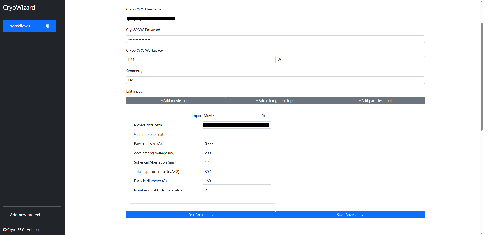

Once all parameters have been entered, click `Save Parameters`, to generate the metadata in the designated `CryoWizard Metadata Path`.

### OPTIONAL STEP: Revise the particle diameter for particle picking and extraction

By default, CryoWizard sets the minimum particle diameter to `Particle Diameter-10` and the maximum particle diameter to `Particle Diameter+10` for picking. 
The default particle extraction box size is `2*Particle Diameter`, where `Particle Diameter` is the value entered by the user.

To adjust the particle diameter for picking and extraction, navigate to the `/parameters/import_parameters_0/` folder in the `CryoWizard Metadata Path` and modify the `Minimum particle diameter (Å)` and `"Maximum particle diameter (Å)` in the `blob_picker_parameters.json` file.
For this dataset, you can adjust the values to:
* **Minimum particle diameter (Å)**: `150`
* **Maximum particle diameter (Å)**: `180`

As shown in the figure below.

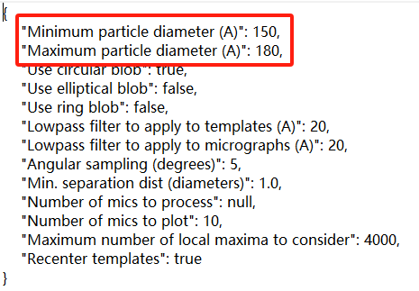

To change the particle extraction box size, open the `/parameters/import_parameters_0/` folder within the `CryoWizard Metadata Path` and modify the `Extraction box size (pix)` in the `extract micrographs_parameters.json` file.
For this dataset, you can set the value to:
* **Extraction box size (pix)**: `256`

As shown in the figure below.


### STEP 2: Run CryoWizard

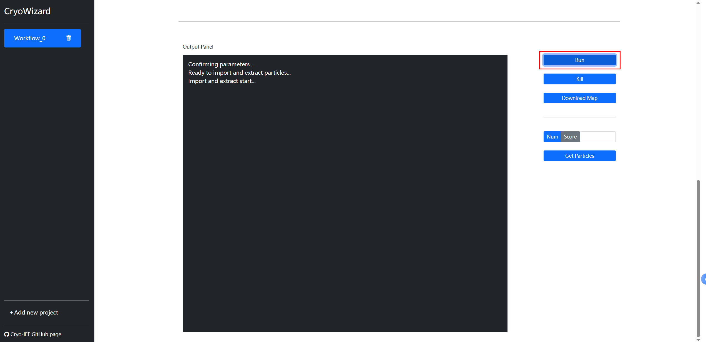

Click `run` to initiate the pipeline. Execution details will be displayed in the gray box on the left.

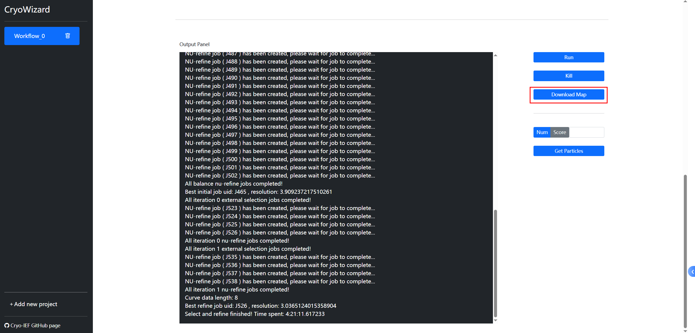

Upon pipeline completion, click the `Download Map` button to download the `map_sharp` from the most recent best nu-refine job.
The final map is shown below.


For this test case (utilizing 4,786 particles), CryoRanker’s inference time is approximately 29 seconds on four V100 GPUs, with a total pipeline runtime of about 4 hours and 21 minutes.